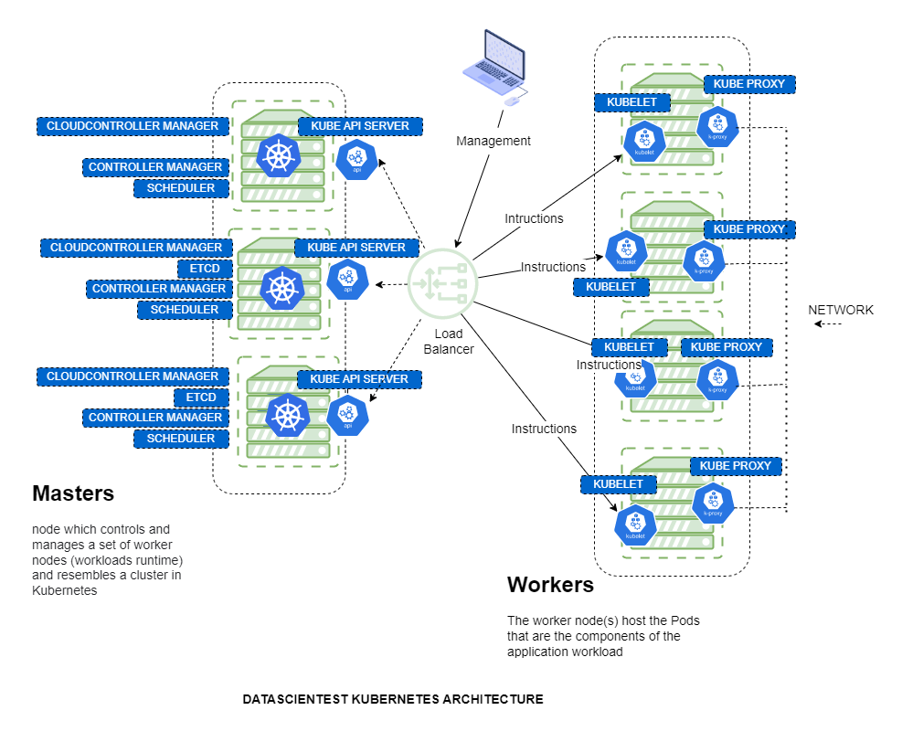
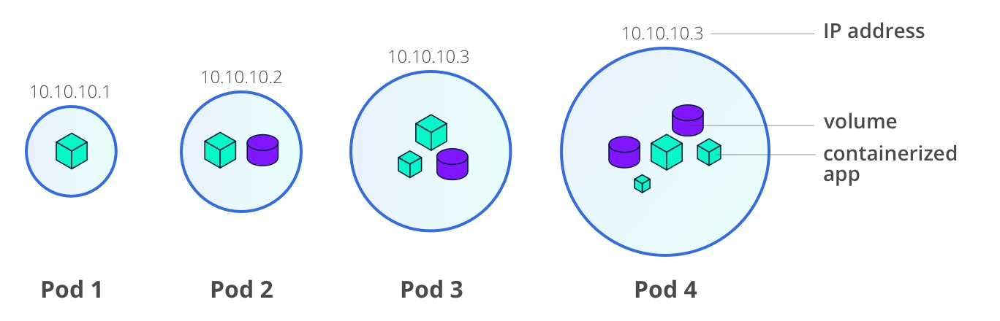
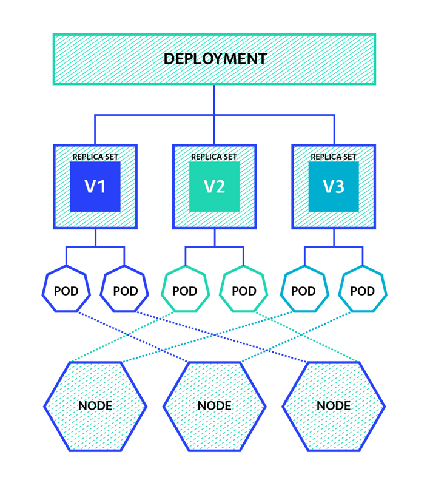
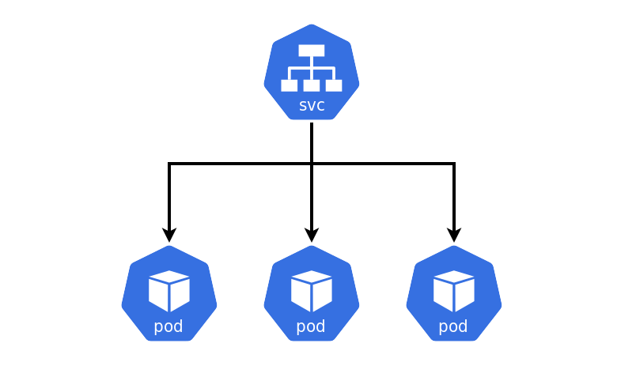
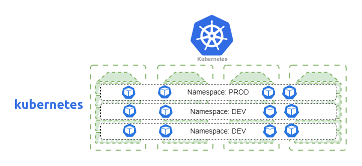
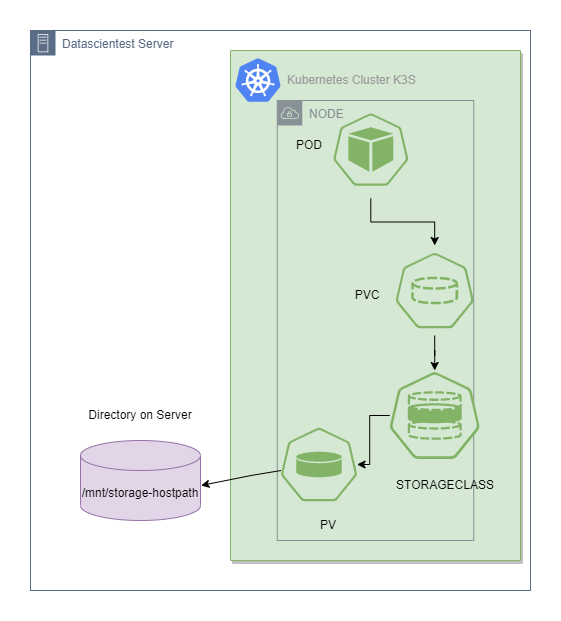
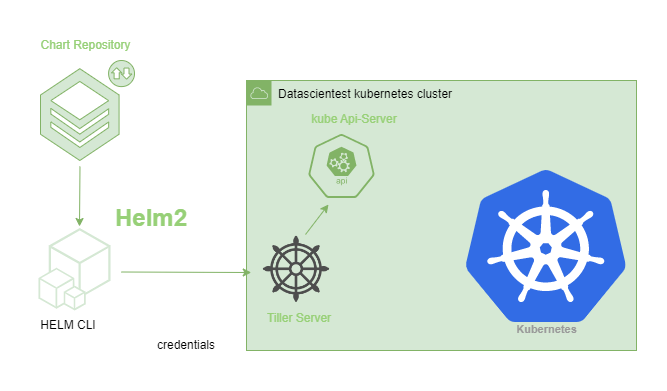
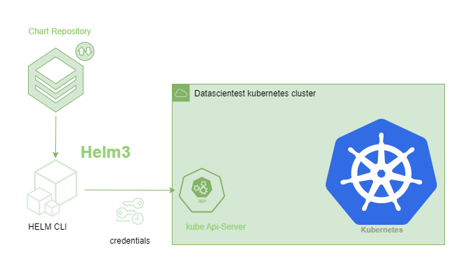
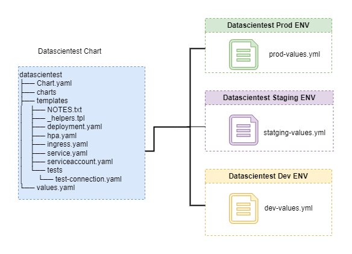

**Cluster** : A set of machine (nodes) connected

**Node**: master and worker 

- Master node contient 5 composants
    - **kube-apiserve**: point de terminaison de l'API REST qui sert de point d'entrée aux communications entre les worker nodes et le Control Plane, il fait l'interface avec les autres éléments du plan de contrôle Kubernetes.
    - **etcd**: base de données clés valeurs pour les informations sur l'état passé ou présent du cluster (considéré comme la source unique de vérité).
    - **kube-scheduler**: surveille et déploie sur un nœud les nouvelles charges de travail (Pods) en fonction de plusieurs facteurs de planification (contraintes de ressources, règles d'anti-affinité, localité des données, etc.).
    - **kube-controller-manager** : contrôleur central qui surveille le nœud, l'ensemble de réplication, les points de terminaison (services) et les comptes de service afin de prendre des mesures en cas de panne.
    - **cloud-controller-manager**: interagit avec le fournisseur de cloud sous-jacent.

- Worker nodes
    - **kubelet** : l'agent s'exécutant sur le nœud worker afin d'inspecter la santé des conteneurs et faire son rapport aux masters, il est également chargé d'écouter les nouvelles commandes du kube-apiserver et de les appliquer sur le nœud sur lequel il est installé.
    - **kube-proxy** : il s'agit du composant chargé de gérer le trafic du réseau, notamment externe.
    - **container runtime** : Il s'agit de la couche qui permet d'exécuter les conteneurs (Docker, rkt, runc).



> Instead of K8s, we can use [K3s](https://k3s.io/) a lightweight Kubernetes

```sh title="kubectl cli"
k3s kubectl get nodes
```

### Les Pods
- Un Pod est pour Kubernetes est ce qu'est un conteneur pour Docker. 
- Un Pod encapsule un ou plusieurs conteneurs qui partageront le même environnement : ressources de stockage, une adresse IP commune et des règles sur la façon dont le ou les conteneurs doivent fonctionner.



- Lorsqu'un Pod est créé, sa propre adresse IP unique lui est attribuée. S'il y a plusieurs conteneurs dans le Pod, ils peuvent communiquer entre eux simplement en utilisant localhost. Les communications à l'extérieur du Pod sont réalisées en exposant un port
- Pour rendre les données persistantes, on devra donc utiliser des Volumes de stockage persistant. Tous les conteneurs d'un Pod seront alors montés sur le même volume.

### Les Contrôleurs

Les Pods sont généralement déployés indirectement par des ressources de charge de travail appelées contrôleurs. Les contrôleurs gèrent le déploiement, la réplication et vérifie la santé des Pods dans le cluster. Si un nœud du cluster tombe en panne, un contrôleur détecte que les Pods de ce nœud ne répondent pas et le Kube Api Server crée des Pods de remplacement sur d'autres nœuds du cluster, afin de préserver l'état de ces ressources même s'il survient des pannes éventuelles.

### Les ReplicaSets
Kubernetes permet de créer des répliques d'un même Pod au sein d'un cluster. Pour cela, nous devons créer un ReplicaSet auquel nous indiquons le nombre de répliques souhaitées. En réalité, lorsque l'on crée un ReplicaSet, un ReplicaSetController est créé dans le Controller Manager pour surveiller que le nombre de répliques en vie d'un Pod correspond bien au spécifications du ReplicaSet.

### Les Deployments
Un Deployment est un manifeste de déploiement pour un ReplicaSet. Il comprend le nombre de copies des conteneurs ainsi que les caractéristiques des ReplicaSets et des Pods. On notera que les Deployments peuvent être utilisés pour une création de ressource comme pour une mise à jour de ressources existantes.

La principale différence entre un Deployment et un ReplicaSet repose justement sur cette notion de mise à jour qui est gérée automatiquement si on crée un Deployment (qui lui même contient un ReplicaSet) et qu'il faudra gérer "à la main" dans le cas où on crée un simple ReplicaSet.

### Les StatefulSets

Les StatefulSets ressemblent beaucoup aux Deployments :

- ils permettent de manager un ensemble de pods ;
- la persistance des données se configure de la même manière.

Cependant, les StatefulSets se distinguent des Deployments car ils ont pour rôle de maintenir l'infrastructure d'une _application stateful_, une application dont le fonctionnement dépend des intéractions précédentes, comme les applications possédant une base de données.

Les différences entre les StatefulSets et les Deployments sont les suivantes :

- les pods ne sont pas créés en même temps, ils sont créés les uns après les autres ;
- les pods ne sont pas adressés au hasard car ils ont des rôles différents ;
- les pods possèdent leur propre identité, ils ne sont pas interchangeables.

Prenons l'exemple d'un StatefulSet qui déploient 3 pods hébèrgant une base de données relationnelle. Un pod aura le rôle de master et les 2 autres le rôle de worker. Un seul pod doit être en charge de l'écriture des données afin d'éviter une incohérence dans les données. Il est donc nécessaire de rediriger les requêtes d'écritures vers le pod master et si celui-ci redémarre à cause d'une panne, il doit reprendre la même identité pour continuer à assurer son rôle de master.

### Les namespaces

Les namespaces sont des espaces logiques, des sous-clusters virtuels qui permettent d'organiser les différents objets que l'on retrouve dans Kubernetes. Au sein d'un namespace, les noms des objets doivent être uniques. De plus, utiliser des namespaces est intéressant dans le cadre d'un cluster avec plusieurs types de personnes y ayant accès. On peut notamment limiter les ressources consommées par un namespace.

### Les Services et Ingress

Lorsqu'on crée un ReplicaSet, les aspects de réseau ne sont pas pris en compte. On doit donc créer un Service pour assurer la communication. Par exemple, la création d'un Service de type ClusterIP permet de donner une même IP à un ensemble de Pods. Il existe différents types de Service (ClusterIP, NodePort, LoadBalance, ExternalIP, ...)

### Les ConfigMaps et les Secrets

Grâce à un ConfigMap, on va pouvoir faire passer un ensemble de clefs-valeurs à des Pods, sous forme de variables d'environnement. Ce genre d'application est très pratique dans le cas où on souhaite créer des templates de conteneurs avec des comportements qui changent en fonction de ces variables d'environnement.

Dans certains cas, on peut souhaiter que ces données soient chiffrées: on doit donc utiliser un Secret pour cela.

### Jobs, CronJobs
Un Job est un travail éphémère parallélisé sur plusieurs Pods. Un CronJob est la même chose mais répété dans le temps à intervalles de temps réguliers.


## kubectl

```sh title="cli syntax"
kubectl [command] [TYPE] [NAME] [flags]

```
Nous avons deux types de commandes possibles pour la configuration de notre cluster kubernetes:

- **La configuration impérative** qui implique la création de ressources Kubernetes directement en ligne de commande sur un cluster.

- **La configuration déclarative** qui définit les ressources dans les fichiers manifestes (fichiers de configuration YAML), puis applique ces définitions au cluster.


```console title="kubectl api-resources"
NAME                              SHORTNAMES   APIVERSION                        NAMESPACED   KIND
bindings                                       v1                                true         Binding
componentstatuses                 cs           v1                                false        ComponentStatus
configmaps                        cm           v1                                true         ConfigMap
endpoints                         ep           v1                                true         Endpoints
events                            ev           v1                                true         Event
limitranges                       limits       v1                                true         LimitRange
namespaces                        ns           v1                                false        Namespace
nodes                             no           v1                                false        Node
persistentvolumeclaims            pvc          v1                                true         PersistentVolumeClaim
persistentvolumes                 pv           v1                                false        PersistentVolume
pods                              po           v1                                true         Pod
podtemplates                                   v1                                true         PodTemplate
replicationcontrollers            rc           v1                                true         ReplicationController
resourcequotas                    quota        v1                                true         ResourceQuota
secrets                                        v1                                true         Secret
serviceaccounts                   sa           v1                                true         ServiceAccount
services                          svc          v1                                true         Service
mutatingwebhookconfigurations                  admissionregistration.k8s.io/v1   false        MutatingWebhookConfiguration
validatingwebhookconfigurations                admissionregistration.k8s.io/v1   false        ValidatingWebhookConfiguration
customresourcedefinitions         crd,crds     apiextensions.k8s.io/v1           false        CustomResourceDefinition
apiservices                                    apiregistration.k8s.io/v1         false        APIService
controllerrevisions                            apps/v1                           true         ControllerRevision
daemonsets                        ds           apps/v1                           true         DaemonSet
deployments                       deploy       apps/v1                           true         Deployment
replicasets                       rs           apps/v1                           true         ReplicaSet
statefulsets                      sts          apps/v1                           true         StatefulSet
selfsubjectreviews                             authentication.k8s.io/v1          false        SelfSubjectReview
tokenreviews                                   authentication.k8s.io/v1          false        TokenReview
localsubjectaccessreviews                      authorization.k8s.io/v1           true         LocalSubjectAccessReview
selfsubjectaccessreviews                       authorization.k8s.io/v1           false        SelfSubjectAccessReview
selfsubjectrulesreviews                        authorization.k8s.io/v1           false        SelfSubjectRulesReview
subjectaccessreviews                           authorization.k8s.io/v1           false        SubjectAccessReview
horizontalpodautoscalers          hpa          autoscaling/v2                    true         HorizontalPodAutoscaler
cronjobs                          cj           batch/v1                          true         CronJob
jobs                                           batch/v1                          true         Job
certificatesigningrequests        csr          certificates.k8s.io/v1            false        CertificateSigningRequest
leases                                         coordination.k8s.io/v1            true         Lease
endpointslices                                 discovery.k8s.io/v1               true         EndpointSlice
events                            ev           events.k8s.io/v1                  true         Event
flowschemas                                    flowcontrol.apiserver.k8s.io/v1   false        FlowSchema
prioritylevelconfigurations                    flowcontrol.apiserver.k8s.io/v1   false        PriorityLevelConfiguration
helmchartconfigs                               helm.cattle.io/v1                 true         HelmChartConfig
helmcharts                                     helm.cattle.io/v1                 true         HelmChart
addons                                         k3s.cattle.io/v1                  true         Addon
etcdsnapshotfiles                              k3s.cattle.io/v1                  false        ETCDSnapshotFile
nodes                                          metrics.k8s.io/v1beta1            false        NodeMetrics
pods                                           metrics.k8s.io/v1beta1            true         PodMetrics
ingressclasses                                 networking.k8s.io/v1              false        IngressClass
ingresses                         ing          networking.k8s.io/v1              true         Ingress
networkpolicies                   netpol       networking.k8s.io/v1              true         NetworkPolicy
runtimeclasses                                 node.k8s.io/v1                    false        RuntimeClass
poddisruptionbudgets              pdb          policy/v1                         true         PodDisruptionBudget
clusterrolebindings                            rbac.authorization.k8s.io/v1      false        ClusterRoleBinding
clusterroles                                   rbac.authorization.k8s.io/v1      false        ClusterRole
rolebindings                                   rbac.authorization.k8s.io/v1      true         RoleBinding
roles                                          rbac.authorization.k8s.io/v1      true         Role
priorityclasses                   pc           scheduling.k8s.io/v1              false        PriorityClass
csidrivers                                     storage.k8s.io/v1                 false        CSIDriver
csinodes                                       storage.k8s.io/v1                 false        CSINode
csistoragecapacities                           storage.k8s.io/v1                 true         CSIStorageCapacity
storageclasses                    sc           storage.k8s.io/v1                 false        StorageClass
volumeattachments                              storage.k8s.io/v1                 false        VolumeAttachment
ingressroutes                                  traefik.containo.us/v1alpha1      true         IngressRoute
ingressroutetcps                               traefik.containo.us/v1alpha1      true         IngressRouteTCP
ingressrouteudps                               traefik.containo.us/v1alpha1      true         IngressRouteUDP
middlewares                                    traefik.containo.us/v1alpha1      true         Middleware
middlewaretcps                                 traefik.containo.us/v1alpha1      true         MiddlewareTCP
serverstransports                              traefik.containo.us/v1alpha1      true         ServersTransport
tlsoptions                                     traefik.containo.us/v1alpha1      true         TLSOption
tlsstores                                      traefik.containo.us/v1alpha1      true         TLSStore
traefikservices                                traefik.containo.us/v1alpha1      true         TraefikService
ingressroutes                                  traefik.io/v1alpha1               true         IngressRoute
ingressroutetcps                               traefik.io/v1alpha1               true         IngressRouteTCP
ingressrouteudps                               traefik.io/v1alpha1               true         IngressRouteUDP
middlewares                                    traefik.io/v1alpha1               true         Middleware
middlewaretcps                                 traefik.io/v1alpha1               true         MiddlewareTCP
serverstransports                              traefik.io/v1alpha1               true         ServersTransport
serverstransporttcps                           traefik.io/v1alpha1               true         ServersTransportTCP
tlsoptions                                     traefik.io/v1alpha1               true         TLSOption
tlsstores                                      traefik.io/v1alpha1               true         TLSStore
traefikservices                                traefik.io/v1alpha1               true         TraefikService
```

### Déploiement d'un Pod

**La configuration impérative**
```sh title="Déploiement d'un Pod with configuration impérative "
kubectl run nginx --image=nginx
kubectl get pod
kubectl get pod --show-labels
```

```console title="Output of get pod"
NAME        READY   STATUS    RESTARTS   AGE
nginx       1/1     Running   0          2m20s
```

**La configuration déclarative**
```YAML title="wordpress.yml "
apiVersion: v1
kind: Pod
metadata:
  name: wordpress
spec:
  containers:
  - name: wordpress
    image: wordpress
    ports:
    - containerPort: 80
```

```sh title="Apply config to cluster"
kubectl apply -f wordpress.yml
```


```console title="kubectl get all"
NAME            READY   STATUS    RESTARTS   AGE
pod/nginx       1/1     Running   0          8m2s
pod/wordpress   1/1     Running   0          4m54s

NAME                 TYPE        CLUSTER-IP   EXTERNAL-IP   PORT(S)   AGE
service/kubernetes   ClusterIP   10.43.0.1    <none>        443/TCP   11h
```

```sh title="Delete pod"
kubectl delete pod nginx wordpress
```

### Les Déploiements

Les déploiements servent à spécifier un état souhaité pour nos Pods et ReplicaSets. 
Le système déclaratif de Kubernetes précise le mode souhaité d'exécution et de gestion des conteneurs.

L'utilisation des déploiements est essentielle dans de nombreux cas afin de :

- Créer automatiquement de nouveaux Pods et ReplicaSets. Le fichier de définition contient des spécifications permettant à Kubernetes d'effectuer la réplication des Pods et des ReplicaSets
- Fournir un moyen déclaratif de décrire l'état souhaité des Pods et des ReplicaSets. Le fichier de définition YAML nous aide à spécifier à quoi ressemblera l'état final des Pods et des ReplicaSets.
- Rétablir un cluster déployé à un état antérieur si l'état actuel est instable. Kubernetes conserve un historique des déploiements, de sorte que des restaurations peuvent être effectuées si nécessaire. Cela peut être utile si nous avons un problème avec la nouvelle version de notre application que nous avons déployer. Les restaurations de déploiement mettent également à jour la révision du déploiement.
- Adapter la charge de travail en créant plus de Pods et de ReplicaSets. Nous pouvons configurer nos déploiements pour augmenter automatiquement le nombre de Pods à mesure que les besoins augmentent.
- Le gestionnaire de contrôleur utilise les spécifications du déploiement pour savoir quand il doit remplacer un Pod défaillant ou un nœud inaccessible, car il surveille l'état des Pods et des nœuds. Cela garantit que les applications critiques pour l'entreprise continuent de fonctionner.




**La configuration impérative**

```sh title="exécute 10 réplicas d'un conteneur NGINX avec la commandes impérative"
kubectl create deployment nginx-deployment --image=nginx --replicas=10

# 10 Pods Nginx avec un hash identique (par exemple 695858cd9d) et des ID différents d’un Pod afin d’identifier de façon unique chaque Pod.
# un déploiement appelé nginx-deployment.
# un Replicaset appelé nginx-deployment-695858cd9d.

```
```console title="kubectl get all"
NAME                                    READY   STATUS    RESTARTS   AGE
pod/nginx-deployment-6d6565499c-7pwmd   1/1     Running   0          27s
pod/nginx-deployment-6d6565499c-bk567   1/1     Running   0          27s
pod/nginx-deployment-6d6565499c-5j7kl   1/1     Running   0          27s
pod/nginx-deployment-6d6565499c-kk56n   1/1     Running   0          27s
pod/nginx-deployment-6d6565499c-5k5pd   1/1     Running   0          27s
pod/nginx-deployment-6d6565499c-zbx27   1/1     Running   0          27s
pod/nginx-deployment-6d6565499c-lmkql   1/1     Running   0          27s
pod/nginx-deployment-6d6565499c-w5ssz   1/1     Running   0          27s
pod/nginx-deployment-6d6565499c-g85mr   1/1     Running   0          27s
pod/nginx-deployment-6d6565499c-7pwc9   1/1     Running   0          27s

NAME                 TYPE        CLUSTER-IP   EXTERNAL-IP   PORT(S)   AGE
service/kubernetes   ClusterIP   10.43.0.1    <none>        443/TCP   11h

NAME                               READY   UP-TO-DATE   AVAILABLE   AGE
deployment.apps/nginx-deployment   10/10   10           10          27s

NAME                                          DESIRED   CURRENT   READY   AGE
replicaset.apps/nginx-deployment-6d6565499c   10        10        10      27s
```

```sh title="Delete deployment"
kubectl delete deployment nginx-deployment
```

**La configuration déclarative**
```YAML title="deployment.yml "
apiVersion: apps/v1
kind: Deployment
metadata:
  name: nginx-deployment
  labels:
    app: web
spec:
  selector:
    matchLabels:
      app: web
  replicas: 10
  strategy:
    type: RollingUpdate
  template:
    metadata:
      labels:
        app: web
    spec:
      containers:
        - name: nginx
          image: nginx
          ports:
            - containerPort: 80
```

```sh title="Apply config to cluster"
kubectl apply -f deployment.yml
```


> Si on supprime un pod `kubectl delete Pod nginx-deployment-[ID]`, le deploiment va automatique re-restituer un nouveau pod.

### Les services

Un service expose un ensemble de Pods exécutant une application, il détient des politiques d'accès et est responsable de l'application de ces politiques pour les demandes entrantes.



- Le besoin de services découle du fait que les Pods dans Kubernetes sont de courte durée et peuvent être remplacés à tout moment. Kubernetes garantit la disponibilité d'un Pod et d'une réplique donnés, mais pas la vivacité des Pods individuels. Cela signifie que les Pods qui doivent communiquer avec un autre Pod n'emploieront pas l'adresse IP du Pod unique sous-jacent mais passeront par le service, qui les relaie vers un Pod pertinent en cours d'exécution.

- Le service se voit attribuer une adresse IP virtuelle, appelée ClusterIP, qui persiste jusqu'à ce qu'elle soit explicitement détruite. Le service agit comme un point de terminaison fiable pour la communication entre les composants ou les applications.

- Un service utilise des labels (étiquettes) et des Selectors (sélecteurs) pour définir quels Pods exposer. Un service peut connecter le front-end d'une application à un back-end, chacun s'exécutant dans un déploiement distinct au sein du cluster.


```yaml
apiVersion: v1
kind: Service
metadata:
  name: my-service
spec:
  selector:
    app: nginx
  ports:
    - protocol: TCP
      port: 80
      targetPort: 8080
```

#### ClusterIP

Le service ClusterIP est le type par défaut dans Kubernetes. Il permet d'attribuer une adresse IP à un groupe de Pods, les rendant accessibles dans le cluster via un point d'entrée. On peut définir une adresse IP spécifique dans le manifeste .yaml du service, mais elle doit être dans la plage d'adresses IP du cluster.

```sh title="Add a clusterIP service"
kubectl expose deploy nginx-deployment --port=80 --type=ClusterIP
```

```console title="kubectl get service"
NAME   TYPE        CLUSTER-IP      EXTERNAL-IP   PORT(S)   AGE
kubernetes         ClusterIP   10.43.0.1       <none>        443/TCP   26h
nginx-deployment   ClusterIP   10.43.139.215   <none>        80/TCP    100s
```

```sh title="Delete service"
kubectl delete svc nginx-deployment # Nous supprimons le service de type clusterIP
```
#### NodePort

- Un service de type NodePort s'appuie sur le service de type ClusterIP, l'exposant sur un port accessible depuis l'extérieur du cluster. Si nous ne spécifions pas de numéro de port, Kubernetes choisit automatiquement un port libre.
- Le composant kube-proxy est responsable de l'écoute sur les ports externes du nœud et du transfert du trafic client du service NodePort vers le ClusterIP.

```sh
kubectl expose deployment nginx-deployment --port=80 --type=NodePort # Nous créons le service de type NodePort
```

```yaml title="Create service type NodePort declaratif"
apiVersion: v1
kind: Service
metadata:
  name: monservicenodeport
spec:
  type: NodePort
  selector:
    app: web
  ports:
  - protocol: TCP
    port: 80
    targetPort: 80
    nodePort: 30000
```

#### LoadBalancer
- Un service de type LoadBalancer est basé sur le service NodePort et ajoute la possibilité de configurer des équilibreurs de charge externes au sein des clouds publics et privés. 
Il expose les services exécutés au sein du cluster en transférant le trafic réseau vers les nœuds du cluster.

```sh
kubectl expose deployment nginx-deployment --port=80 --type=LoadBalancer # Nous créons le service de type LoadBalancer
```

```yaml
apiVersion: v1
kind: Service
metadata:
  name: monserviceloadbalancer
spec:
  type: LoadBalancer
  clusterIP: 10.43.5.11
  loadBalancerIP: 168.196.90.10
  selector:
    app: web
  ports:
    - name: http
      protocol: TCP
      port: 80
      targetPort: 80
```

> Le status de votre load balancer restera pending car nous n'utilisons ni cloud provider ni MetalLB pour implémenter celui-ci.

### ReplicaSet
- Un ReplicaSet est un processus dans Kubernetes qui maintient un nombre spécifié d'instances d'un Pod en s'assurant qu'ils s'exécutent en continu. Son but est d'empêcher les utilisateurs de perdre l'accès à leur application lorsqu'un Pod tombe en panne ou est inaccessible.
- Le ReplicaSet aide à mettre en place une nouvelle instance d'un Pod lorsque celui existant échoue, à le mettre à l'échelle lorsque les instances en cours d'exécution n'atteignent pas le nombre spécifié, et à réduire ou supprimer des Pods si une autre instance avec le même libellé est créée.

```
kubectl get replicaset # ou kubectl get rs
kubectl scale deploy nginx-deployment --replicas=1

```

```yaml
apiVersion: apps/v1
kind: ReplicaSet
metadata:
    name: httpd-replicaset
spec:
    replicas: 3
    selector:
       matchLabels:
          app: httpd
    template:
       metadata:
          labels:
            app: httpd
            env: dev
       spec:
          containers:
          - name: httpd
            image: httpd
```

```sh
kubectl create -f replicaset.yml
kubectl scale rs httpd-replicaset --replicas=5

```

### Namespaces



- Les Namespaces (Espaces de nom) permettent d'isoler, de regrouper et d'organiser les ressources au sein d'un cluster Kubernetes. Dans de nombreux cas d'utilisation, la création de Namespaces Kubernetes peut nous aider à rationaliser les opérations, à améliorer la sécurité, et même à améliorer les performances.
- Les Namespaces peuvent être vus comme un cluster virtuel ou un sous-cluster Kubernetes qui fournit une portée pour les charges de travail. Les noms des ressources doivent être uniques au sein d'un Namespace, mais cette règle ne s'applique pas entre les Namespaces.

- Les ressources à l'intérieur des Namespaces sont logiquement séparées les unes des autres mais elles peuvent toujours communiquer.
- Les Namespaces ne fournissent pas une véritable multi-location comme le font d'autres solutions (telles que l'infrastructure virtuelle de cloud public ou le cloud privé Openstack).
- Il existe un seul Namespace Kubernetes par défaut appelé default, mais vous pouvez créer autant de Namespaces que nécessaire dans un cluster.
- Les Namespaces ne peuvent pas être imbriqués les uns dans les autres.

```sh
kubectl create namespace datascientest
kubectl get all -n datascientest
kubectl create deployment wordpress --image=wordpress --replicas=3 --namespace datascientest
```


## Persistant Volumes




- Une PersistentVolumeClaim (PVC) est une demande de stockage par un utilisateur. Elle est similaire à un Pod car les Pods consomment des ressources de nœuds et les PersistentVolumeClaim consomment des ressources de volumes persistants.

- Pour utiliser un volume persistant, nous devons donc fournir une PersistentVolumeClaim à laquelle Kubernetes associera le PV approprié. Si aucun volume persistant ne correspond à la demande (PVC), on peut utiliser les objets de type StorageClass pour créer dynamiquement un PV et le lier au PVC fourni.

- Il est important de comprendre que Kubernetes ne limite pas les volumes persistants à un seul Namespace, ce qui signifie qu'un Pod, dans n'importe quel namespace, peut réclamer un volume persistant pour le stockage.

```yaml
apiVersion: v1
kind: PersistentVolume
metadata:
  name: datascientest-pv
spec:
  capacity:
    storage: 10Gi
  accessModes:
    - ReadWriteOnce
  hostPath:
    path: "/mnt/data"
  storageClassName: local-path
```

Les objets de type StorageClass sont utilisés pour définir les classes de stockage proposées au sein de Kubernetes. La StorageClass est utilisée pour créer des PV dynamiques. Si Kubernetes ne trouve pas de PV correspondant à un PersistentVolumeClaim (PVC), la StorageClass peut créer automatiquement un PV pour le PVC.

```sh
kubectl get storageclass
```

**Creer PVC**

```yaml title="PVC declaratif"
apiVersion: v1
kind: PersistentVolumeClaim
metadata:
  name: pvc-datascientest
spec:
  accessModes:
    - ReadWriteOnce
  storageClassName: local-path
  resources:
    requests:
      storage: 128Mi
```

**Creer un Pod with PVC**
```yaml
apiVersion: v1
kind: Pod
metadata:
  name: pod-datascientest
  labels:
    app: nginx
spec:
  containers:
    - name: nginx
      image: nginx
      imagePullPolicy: IfNotPresent # Télécharge l'image uniquement si elle n'est pas présente
      volumeMounts:
        - name: datascientest-volume
          mountPath: /usr/share/nginx/html/ # Répertoire dans le conteneur qui sera monté sur le volume
      ports:
        - containerPort: 80
  volumes:
    - name: datascientest-volume # Nom du volume persistant
      persistentVolumeClaim:
        claimName: pvc-datascientest # Nom du PVC à utiliser
```

## Secrets

Les Secrets sont des objets Kubernetes destinés à stocker une petite quantité de données sensibles. Au sein de Kubernetes, les secrets sont encodés en base64, ce qui n'est pas extrêmement sécurisé. Cependant, pour le mot de passe root d'une base de données MariaDB, l'encodage base 64 convient parfaitement.

```sh
kubectl create secret generic mariadb-user --from-literal=MARIADB_USER=datascientestuser --from-literal=MARIADB_PASSWORD=DatascientestMariadb@..
```

```yaml
apiVersion: v1
kind: Secret
metadata:
  name: mariadb-root-password
type: Opaque
data:
  password: RGF0YXNjaWVudGVzdDIwMjNAISE=
```

```sh title="Décodage d'un secret"
kubectl get secret mariadb-root-password -o jsonpath='{.data.password}'

kubectl get secret mariadb-root-password -o jsonpath='{.data.password}' | base64 --decode
```

```yaml title="Use secret dans config"
apiVersion: v1
kind: Pod
metadata:
  name: env-single-secret
spec:
  containers:
  - name: envars-test-container
    image: nginx
    env:
    - name: SECRET_USERNAME
      valueFrom:
        secretKeyRef:
          name: backend-user
          key: backend-username
```

## ConfigMaps

- Les ConfigMaps, comme les Secrets, peuvent être créés et partagés dans les conteneurs, la principale différence est l'encodage en base64.
- Les ConfigMaps sont destinés aux données non-sensibles telles que les fichiers de configuration et les variables d'environnement. Ils constituent un excellent moyen de créer des services d'exécution personnalisés à partir d'images de conteneurs génériques.

```yaml title="mysqld.cnf"
[mysqld]
max_allowed_packet = 128M
```

```sh
kubectl create configmap cm-mariadb --from-file=mysqld.cnf
kubectl describe cm cm-mariadb
kubectl get configmap cm-mariadb -o "jsonpath={.data['mysqld.cnf']}" # 
```

```yaml title="use config and secret"
apiVersion: apps/v1
kind: StatefulSet
metadata:
  name: mariadb
spec:
  selector:
    matchLabels:
      app: mariadb
  serviceName: mariadb
  replicas: 1
  template:
    metadata:
      labels:
        app: mariadb
    spec:
      containers:
        - name: mariadb
          image: docker.io/mariadb:10.4
          ports:
            - containerPort: 3306
              protocol: TCP
          env:
            - name: MARIADB_ROOT_PASSWORD
              valueFrom:
                secretKeyRef:
                  name: mariadb-root-password
                  key: password
          envFrom:
            - secretRef:
                name: mariadb-user
          volumeMounts:
            - name: data
              mountPath: /var/lib/mysql
            - name: config
              mountPath: etc/mysql/conf.d

      volumes:
        - emptyDir: {}
          name: data
        - name: config
          configMap:
            name: cm-mariadb
            items:
              - key: mysqld.cnf
                path: mysqld.cnf                
```

> Le champ items est une liste dont le champ key représente la section ou groupe de paramètres, et le champ path représente le chemin du fichier créé avec les paramètres de la section correspondante. Ces fichiers seront créés dans le dossier en valeur du champ mountPath du volumeMount spécifié ci-dessus : /etc/mysql/conf.d.

## Health Checks

- le Liveness Probe vérifie l'état du Pod (s'execute ou non), et redémarre le Pod si le test échoue.
- les Readiness Probe vérifie si notre application est prête à répondre aux requêtes. Lorsque la vérification de l'état de préparation échoue, l'adresse IP du Pod est supprimée de la liste des points de terminaison du service.


```yaml
apiVersion: apps/v1
kind: Deployment
metadata:
  name: vote
spec:
  strategy:
    type: RollingUpdate
    rollingUpdate:
      maxSurge: 2
      maxUnavailable: 1
  revisionHistoryLimit: 4
  replicas: 12
  minReadySeconds: 20
  selector:
    matchLabels:
      role: vote
    matchExpressions:
      - {key: version, operator: In, values: [v1, v2, v3, v4, v5]}
  template:
    metadata:
      name: vote
      labels:
        app: python
        role: vote
        version: v1
    spec:
      containers:
        - name: app
          image: schoolofdevops/vote:v1
          resources:
            requests:
              memory: "64Mi"
              cpu: "50m"
            limits:
              memory: "128Mi"
              cpu: "250m"
          livenessProbe:
              tcpSocket:
                port: 80
              initialDelaySeconds: 5
              periodSeconds: 5
          readinessProbe:
              httpGet:
                path: /
                port: 80
              initialDelaySeconds: 5
              periodSeconds: 3
```

## Autoscaling dans Kubernetes
Il existe trois types d'autoscalers au sein de kubernetes :

- Horizontal Pod Autoscaler (HPA) : Il ajuste le nombre de réplicas d'une application. L'HPA met à l'échelle le nombre de Pods dans un contrôleur de réplication, un déploiement, un Replicaset ou un Statefulset en fonction de l'utilisation du processeur. HPA peut également être configuré pour prendre des décisions de mise à l'échelle en fonction de métriques personnalisées ou externes.

- Cluster Autoscaler (CA) : Il ajuste le nombre de nœuds dans un cluster, il ajoute ou supprime automatiquement des nœuds dans un cluster. Lorsque les nœuds ne disposent pas de ressources suffisantes pour exécuter un Pod, il ajoute un nœud. Lorsqu'un nœud reste sous-utilisé, ses Pods peuvent être affectés à un autre nœud. Il peut aussi supprimer les nœuds inutilisés.
- Vertical Pod Autoscaler (VPA) : Il ajuste les demandes de ressources (Requests) et les limites (Limits) des conteneurs dans le cluster.


## Helm

Helm est un gestionnaire de packages pour les applications Kubernetes. Au cours des dernières années, Kubernetes s'est considérablement développé, tout comme l'écosystème qui le soutient. Récemment, Helm a reçu le statut de diplômé de la Cloud Native Computing Foundation (CNCF) , ce qui montre sa popularité croissante parmi les utilisateurs de Kubernetes.




### Helm Charts
- Un chart est une collection de fichiers organisés dans une structure de répertoires spécifique

- Les informations de configuration liées à un graphe sont gérées dans la configuration

- Enfin, une instance en cours d'exécution d'un chart avec une configuration spécifique est appelée une release

Helm suit un chart installé dans le cluster Kubernetes à l'aide de releases. 
Cela nous permet d'installer un seul chart plusieurs fois avec différentes versions dans un cluster

À partir de Helm 3, les versions sont stockées en tant que secrets par défaut dans le Namespace où nous déployons notre Chart.

**Qu'est-ce qu'un Chart Helm ?**

Un cas concret d’utilisation afin de bien comprendre l’utilité serait d’avoir trois environnements différents dans notre projet datascientest : Dev, Staging et Prod. Chaque environnement aura des paramètres différents pour notre déploiement :

- En environnent de Dev, nous n'aurons besoin que d'un seul réplica pour notre Pod.
- En environnements de staging et production, nous aurons plus de réplicas avec la mise à l'échelle automatique (HPA) des Pods.
- Les règles d‘Ingress seront différentes pour chaque environnement.
- Les Configmaps et les secrets seront différents pour chaque environnement.




Les charts Helm sont une combinaison de modèles de manifeste Kubernetes YAML et de fichiers spécifiques à Helm.

Helm utilise le moteur de template go pour la fonctionnalité de template.

```sh title="Install Helm"
curl https://baltocdn.com/helm/signing.asc | gpg --dearmor | sudo tee /usr/share/keyrings/helm.gpg > /dev/null
sudo apt-get install apt-transport-https --yes
echo "deb [arch=$(dpkg --print-architecture) signed-by=/usr/share/keyrings/helm.gpg] https://baltocdn.com/helm/stable/debian/ all main" | sudo tee /etc/apt/sources.list.d/helm-stable-debian.list
sudo apt-get update
sudo apt-get install helm=3.15.1-1

export KUBECONFIG=/etc/rancher/k3s/k3s.yaml

helm version
helm list

```

```sh title="Helm cli"
# Ajoutez le chart repository se trouvant à l'adresse https://airflow.apache.org.
helm repo add apache-airflow https://airflow.apache.org
helm repo list

# Chargez la configuration des objets Kubernetes dans un fichier nommé templates.yaml.
helm template apache-airflow/airflow > templates.yaml
helm show values apache-airflow/airflow > values.yaml

kubectl create namespace airflow

# Installez l'application Airflow depuis le répertoire apache-airflow et la chart airflow dans le namespace airflow.
helm -n airflow upgrade --install airflow apache-airflow/airflow

kubectl -n airflow get pod
sudo kubectl config set-context --current --namespace=airflow
kubectl config get-contexts

# Créez le port-forward.
kubectl port-forward svc/airflow-webserver --address 0.0.0.0 8080:8080

```


